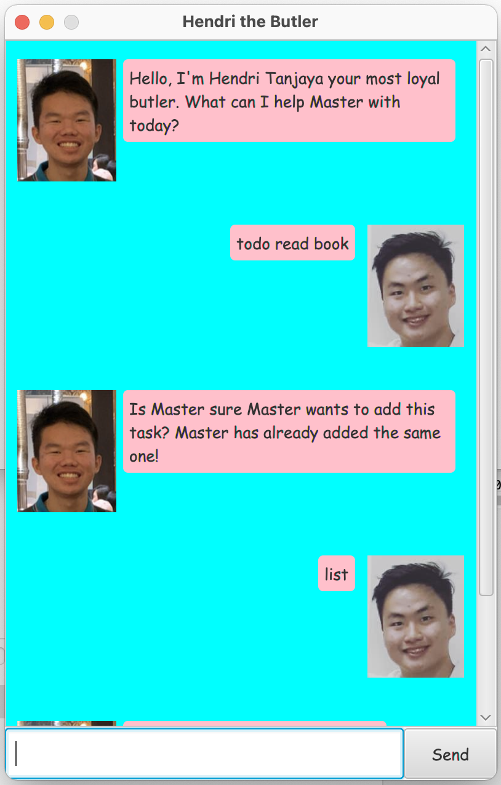

# Hendri the Butler User Guide
Hendri is a powerful butler that will serve you as his Master with all his might
and power. Hendri is equipped with an ability to manage your tasks. The GUI is
very pretty and very easy to use. 

## Setup
To start using Hendri the Butler, you could follow the following steps:
1. Ensure that you have installed Java 11 or above on your local computer. 
2. Download the latest duke.jar file from this repo, or by clicking [here](https://github.com/vishandi/ip/releases/download/A-Release/duke.jar)
3. Double click on the downloaded .jar application
4. Enjoy using Hendri the Butler! 

## Features  

### Chat-like GUI

Hendri the Butler is constructed like a chatting platform. That way, you will 
feel like chatting with Hendri instead of managing your task. With Hendri's 
personality that prioritizes his Master's happiness, you will surely satisfied 
with Hendri's service. Pro-tip: Try to make mistakes in inputting the commands, 
you will find many of Hendri's messages fascinating!



### Managing Your Tasks

Hendri knows 3 (three) types of tasks:
- Todo (has description only)
- Deadline (needs to be done by Deadline Date)
- Event (happens in Event Date)

Now you might ask: **what can I do with these tasks?** You can add, mark, unmark, delete, 
find, and view your tasks!

### Detecting duplicate tasks

As Hendri has a very high IQ, Hendri could know when you add multiple tasks that have 
the same type and description. In this case, Hendri will not add the duplicated task. 

### Interpreting Dates

Again as Hendri has a very high IQ, Hendri could know many date format, including:
"yyyy-MM-dd", "yyyy/MM/dd", "yyyy MMM dd", "dd MMM yyyy", "dd-MM-yyyy", "dd/MM/yyyy".

## Usage

### `todo` - Add a Todo task

Format: `todo DESCRIPTION`
<br>
You can add a Todo task with description DESCRIPTION

Expected outcome:
<br>
A todo task with description: DESCRIPTION will be added to your task list!

Example of usage: 

`todo read book`


```
Expected output:
Yey! Hendri got another task to handle for Master! Okay, Hendri has added this task: 
[T][ ] read book 
Now Master has 2 tasks in the list.
```

### `deadline` - Add a Deadline task

Format: `deadline DESCRIPTION /by DATE`
<br>
You can add a Deadline task with description DESCRIPTION that has a deadline on DATE.
DATE can be of format: "yyyy-MM-dd", "yyyy/MM/dd", "yyyy MMM dd", "dd MMM yyyy", "dd-MM-yyyy", "dd/MM/yyyy".

Expected outcome:
<br>
A Deadline task with description: DESCRIPTION and deadline time: DATE will be added to your task list!

Example of usage:

`deadline learn math /by 2022-10-20`


```
Expected output:
Yey! Hendri got another task to handle for Master! Okay, Hendri has added this task: 
[D][ ] learn math (by: Oct 20 2022) 
Now Master has 3 tasks in the list.
```

### `event` - Add an Event task

Format: `event DESCRIPTION /at DATE`
<br>
You can add an Event task with description DESCRIPTION that is going to be held on DATE.
DATE can be of format: "yyyy-MM-dd", "yyyy/MM/dd", "yyyy MMM dd", "dd MMM yyyy", "dd-MM-yyyy", "dd/MM/yyyy".

Expected outcome:
<br>
An Event task with description: DESCRIPTION and event time: DATE will be added to your task list!

Example of usage:

`event Ed Sheeran Cocncert /at 08 Sep 2022`


```
Expected output:
Yey! Hendri got another task to handle for Master! Okay, Hendri has added this task: 
[E][ ] Ed Sheeran Cocncert (at: Sep 08 2022) 
Now Master has 4 tasks in the list.
```

### `mark` - Mark a Task

Format: `mark INDEX`
<br>
You can mark a Task at index INDEX as **done** by following the command.

Expected outcome:
<br>
The Task at index INDEX is marked as done and you can see a [X] in the task if 
you print your task list.

Example of usage: (Assuming task number 2 is Todo read book)

`mark 2`


```
Expected output:
Great job Master! You have finished this task! Hendri has marked this task as done: 
 [T][X] read book 
```

### `unmark` - Unmark a Task

Format: `unmark INDEX`
<br>
If you wrongly marked a task, fret not. 
You can unmark a Task at index INDEX as **done** by following the command.

Expected outcome:
<br>
The Task at index INDEX is marked as undone and you can see a [ ] in the task if
you print your task list.

Example of usage: (Assuming task number 2 is Todo read book)

`unmark 2`


```
Expected output:
Are you not doing well Master? Why are you unmarking this task: 
 [T][ ] read book 
```

### `delete` - Delete a Task

Format: `delete INDEX`
<br>
If you wrongly added a task, fret not.
You can delete a Task at index INDEX by following the command.

Expected outcome:
<br>
The Task at index INDEX is deleted.

Example of usage: (Assuming task number 2 is Todo read book)

`delete 2`


```
Expected output:
Are you not satisfied with Hendri's service Master :( ? Okay, Hendri has removed this task: 
 [T][ ] read book 
 Now Master has 3 tasks in the list. 
```

### `find` - Find Tasks by Keyword

Format: `find KEYWORD`
<br>
You can find all tasks that contain keyword KEYWORD in your task list.

Expected outcome:
<br>
All tasks that contain the keyword.

Example of usage:

`find math`


```
Expected output:
Okay! Here are the matching tasks in Master's list:
1. [D][ ] learn math (by: Oct 20 2022)
2. [T][ ] read math
```

### `list` - List all tasks

Format: `list`
<br>
You can view all your tasks by this simple command!

Expected outcome:
<br>
All tasks.

Example of usage:

`list`


```
Expected output:
Here are Master's current tasks:
1. [T][ ] read
2. [D][ ] learn math (by: Oct 20 2022)
3. [E][ ] Ed Sheeran Cocncert (at: Sep 08 2022)
4. [T][ ] read math
```

### `bye` - Saying Goodbye to Hendri

Format: `bye`
<br>
Bye Bye Hendri!

Expected outcome:
<br>
Hendri says bye and close the application. 

Example of usage:

`bye`


```
Expected output:
Although Hendri feels very saddened by this separation, I Hope to see you soon master!
```
